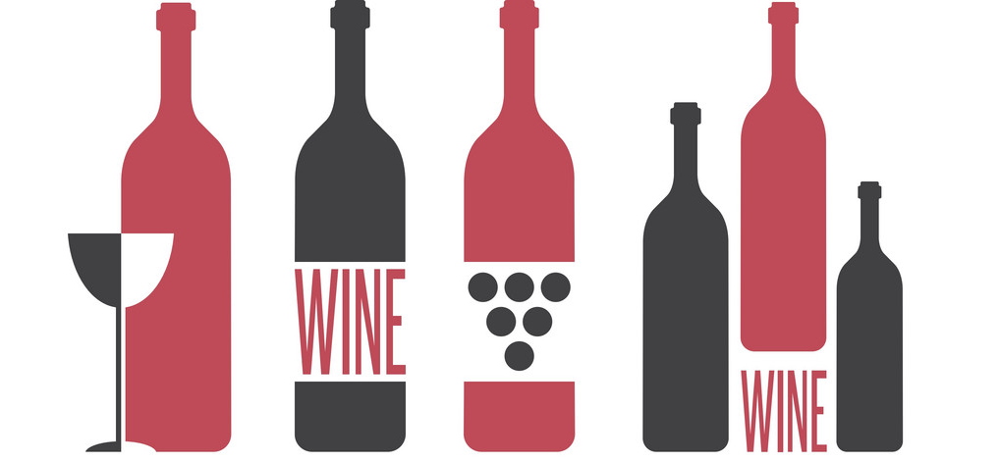
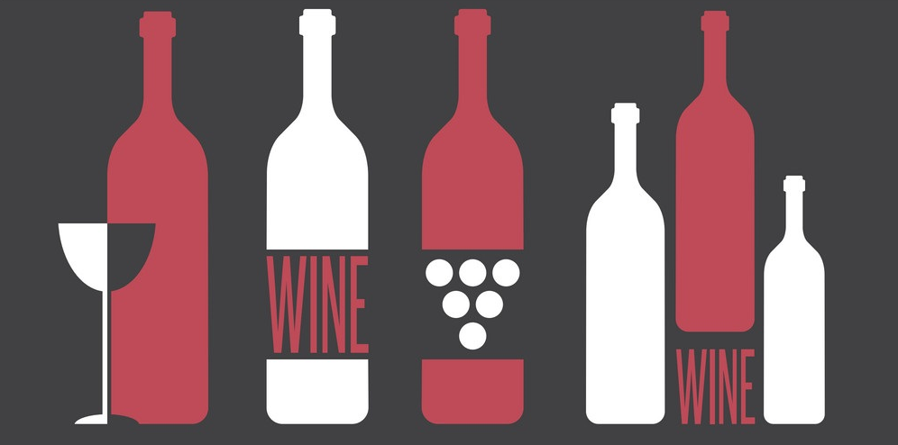

\par
{width=400px}


```{r, include = FALSE, message = FALSE, warning = FALSE}
library(ggplot2)
library(stats)
library(tidyverse)
library(moderndive)
library(dplyr)
library(infer)
library(knitr)
library(skimr)
library(ggpubr)
library(ISLR)
library(readr)

#red_data <- winequality.red
#white_data <- winequality.white
red_data <- read_delim("winequality-red.csv", ";", escape_double = FALSE)
white_data <- read_delim("winequality-white.csv", ";", escape_double = FALSE)

names(red_data)<-str_replace_all(names(red_data), c(" " = "." , "," = "" ))
names(white_data)<-str_replace_all(names(white_data), c(" " = "." , "," = "" ))

white_data2 <- white_data %>% 
  mutate(color = "white")
red_data2 <- red_data %>%
  mutate(color = "red")
total_data <- rbind(white_data2, red_data2) 

```


\newpage

\section{Abstract}

Why should anybody study wine? It's the lowest on the priority list, especially given today's climate. However, that is exactly the reason I submit to you as to why we should. It’s nice to take a step back.\par
Take a step back from the overwhelming issues of the modern day, and skim over some quaint, sleepy data that leads to delightful conclusions, data that can be used for light-hearted casual conversations and to quench a little interest in our everyday passing thoughts. \par
We will explore the different variables in this dataset and see how they relate to the quality of wine. It’s interesting to see that there are even variables related to quality. Does this imply that scientifically, there is a highest quality wine? Could we establish solid correlations between different variables, or maybe observe possible distributions in the samples?

This paper was made in R Markdown.


\section{Introduction}


As I was preparing for this paper, I found out that there is an active field of study dedicated to research of grapes, called viticulture. In specific, the field dedicated to the research of grapes made for wine is called viniculture. Scientific advances in this field have allowed our society to continue celebrating life with a little flavor, finding standards for chemicals allowed in wine production has kept people from drinking unwanted poisons.


\subsection{Formatting of this paper, and literature}

'Modeling wine preferences by data mining from physicochemical properties' by Cortez et al, is the original article that used this dataset. The majority of the article uses machine learning,  which I am not familiar with. However, in the appendix, there is a table that lists the variables and the units used, so I could find information in other articles and convert them to the units used in the article. For example, I needed to convert 400 mg/L to 0.4 g/L, which was crucial for data wrangling. \par
The different tests have a different section or subsection. I hope to do a lot of hypotheses testing based on different literature thats available in articles listed in the bibliography. We will also see if a specific variable follows a normal distribution. Each section will elaborate on how the literature is relevant, and if it applies to our data for Vinho Verde.

\newpage
## A little bit about the datasets.

This data was collected from the "Vinho Verde" wine samples, from the north of Portugal.

Vinho Verde literally means "green wine", but rather than referring to the color, it describes its character. Young, crisp and fresh, this wine has a sparkle and a relatively low alcohol content.

The data collection was sponsored by the Viticulture Commission of the Vinho Verde Region, Porto, Portugal.\par

The dataset `white_data` contains sample data for 4898 white wines from some unknown population.
The dataset `red_data` contains sample data for 1599 red wines from some unknown population. 
The variables are summarized below, as given by the winequality.names file and [Cortez et al., 2009].\par
The purpose of the data collection was to model wine quality based on physicochemical tests. As you can see in the following list of input variables, all of them are chemical tests, and the output variable is quality. 

Here are the variables used in both of the datasets.\par
   Input variables (based on physicochemical tests): \par
*  fixed acidity \par
*  volatile acidity \par
*  citric acid \par
*  residual sugar \par
*  free sulfur dioxide \par
*  total sulfur dioxide \par
*  density \par
*  pH \par
*  sulphates \par
*  alcohol \par
*  chlorides \par

Output variable (based on sensory data):  \par
*  quality (score between 0 and 10) \par
   
I merged both datasets into total_data, for statistics used on both of them.
   

## Focus of the project

Data analytics servies like the Winery Lab and ETS Lab do plenty of research on standards of wine quality. 

The Winery lab lists a few variables as the most common tests run in wine analysis, here are those which we have in our datase: \par
*  pH \par
*  Sulfur Dioxide \par
*  Alcohol \par
*  Volatile Acidity \par
*  Residual Sugar \par

Let's observe these variables. Let's focus on volatile acidity, and also look at residual sugar, quality, and alcohol. We will also look at one of the less commonly tested variables, chlorides.

\newpage


# Volatile Acidity

Note: Due to the inequalities in the original hypotheses, we adjust the hypotheses so that the null hypotheses has an equality in it. We expect it to fail. We then use the result and visuals to figure out which side of the value the statistical mean lies.


## Wine Spoilage
Wine spoilage is legally defined by volatile acidity, largely composed of acetic acid, as stated by Ezekiel Neeley from the Waterhouse Lab. \par
He observes that the U.S. legal limits of Volatile Acidity are 1.2 g/L for Red Table Wine, and 1.1 g/L for White Table Wine.  \par
I removed 5 out of 6497 data points that were above the limit in the total_data dataset. \par
```{r, echo = FALSE, message = FALSE, warning = FALSE}
total_data <- total_data %>% filter(volatile.acidity < 1.2)
total_data <- total_data %>% filter(volatile.acidity != 1.100)
```


The article says that the average level of acetic acid in a new dry table wine is less than 0.4 g/L. \par
Let's prime our dataset and filter out the dry wines from the data set 'total'. EU regulations says dry wine has up to 4 g/L of residual sugar, so we will filter out the rest. \par


Then we will test the average level of dry wine for $\mu = 0.4$.
Do we agree with the article or not?\par
Let's choose $\alpha = 0.05$.\par
$$H_0: \mu \leq 0.4, H_\alpha: \mu > 0.4$$
I can't figure out how to do one test for the above, so I will do this test instead and get p-value for one direction.\par
$H_0: \mu = 0.4, H_\alpha: \mu  \neq 0.4$\par

We used bootstrapping and the package 'infer' for this exercise.

      
  

```{r,  message = FALSE, warning = FALSE}


dry_data <- total_data %>% filter(residual.sugar < 4)
obs_mean <- dry_data %>% 
  specify(response = volatile.acidity) %>% 
  calculate(stat = "mean")
obs_mean
set.seed(238)
null_distribution1 <- dry_data %>%
  specify(response = volatile.acidity) %>% 
  hypothesize(null = "point", mu = 0.4) %>% 
  generate(reps = 1000, type = "bootstrap") %>% 
  calculate(stat = "mean")

percentile_ci <- null_distribution1 %>% 
  get_confidence_interval(level = 0.95, type = "percentile", point_estimate = obs_mean)
percentile_ci

null_distribution1 %>%
  get_p_value(obs_stat =  obs_mean, direction = "two_sided")


visualize(null_distribution1, bins = 20) + 
  shade_confidence_interval(endpoints = percentile_ci,  color = "darkred", fill = "wheat2") +
  shade_p_value(obs_stat = obs_mean, direction = "two_sided")

```
The bright red line is the sample mean value, where the sample gives us a value of 0.3731623, and there is 0% chance that the value is in the red shaded region assuming the null hypothesis H0 is true.\par
It failed the null hypotheses, and gave p = 1 to be on the left of the hypothesized mean of 0.4. Calculating the mean of the data gave $\mu = 0.3731623$, so we can safely say that we reject the adjusted null hypotheses, the wine does not have VA of 0.4. \par
Let's test if the value is less than 0.4.

$$H_0: \mu = 0.4, H_\alpha: \mu  < 0.4$$

We fail the null hypothesis, and accept the alternate hypotheses, the wine is a typical dry table wine with an average level of acetic acid.


\newpage
## Aroma Threshold
The aroma detection threshold is the lowest concentration of a compound that is detectable by the human sense of smell. \par
The same article as above states that the aroma threshold for acetic acid in red wine varies from 600 mg/L and 900 mg/L. Let's test if people can smell the vinegar in Vinho Verde red wine. Let's choose $\alpha = 0.10$, one tailed test. 

$$H_0: \mu \leq 0.6, H_\alpha: \mu > 0.6$$
I can't figure out how to do one test for the above, so I will do this test instead:
$$H_0: \mu = 0.6, H_\alpha: \mu < 0.6$$
 and if we don't reject the null hypotheses, we will repeat with the opposite inequality for $H_\alpha$ \par
Let's do this the hand-written method. Here is the sample mean, variation, and length n, respectively.
```{r, echo = FALSE, message = FALSE, warning = FALSE}


mean(total_data$volatile.acidity)
var(total_data$volatile.acidity)
length(total_data$volatile.acidity)


```


$$\bar{X} = 0.338914, \bar{\sigma}^2 = 0.02637234, n = 6492$$

$$\bar{Z} = \frac{\bar{X} - 0.6}{\frac{\bar{\sigma}}{\sqrt{n}}}$$


We find that Z = -126, a very low value. The probability that a value is less than Z is 0 < 0.05, so we reject the null hypotheses, and accept the alternate hypotheses, that people can't smell the vinegar in Vinho Verde wine.


\newpage


## Low or High VA
The article 'Volatile Acidity in Wine' written by Denise Gardner in the Penn State Extension, states that lower-VA wines have less than 0.7 g/L acetic acid, and higher-VA wines have greater than or equal to 0.7 g/L acetic acid. \par
Let's do a hypothesis testing to see if the population of Vinho Verde wines is on average a low or high Volatile Acidity wine based on this sample, with $\alpha = 0.05$. \par
$$H_0: \mu \geq 0.7, H_\alpha: \mu < 0.7$$


From the previous exercise, we noticed that the average volatile acidity is less than 0.6 for Vinho Verde wine. We don't have to repeat the hypotheses testing to agree that its less than 0.7. \par 
Therefore, we reject the null hypotheses, and accept that vinho Verde is a low VA wine in general.


## Quality 
Finally, I would like to test if there is a correlation between volatile acidity and quality.
Are highly acidic wines low quality? I would test this, as the point of the paper is to look at quality. But I can't because there is very skewed ratio of data points with low VA to high VA, so any correlations we look at wouldn't be fair.


\newpage
#  Chlorides

Let's look at one of the less often tested variables: chlorides. \par I chose this variable because of the following interesting observation.

```{r, echo = FALSE, message = FALSE, warning = FALSE}

ggplot(total_data, aes(x = chlorides, fill = color)) +
  geom_histogram(binwidth = .01, color = "black") + ggtitle("Histogram of Chlorides") +   facet_wrap(~ color) + scale_fill_manual(values=c("darkred", "wheat2"))
```
We can see that the both samples of wines have normalish distributions with right skews.  Visually we can see that white has a mean of 0.04, and red has a mean of 0.08, which are pretty different values. However, the distributions overlap a lot, there's a chance the statistical mean is the same.\par

Let's test if the samples have normal distribution, by qqplots to check for normality: one for red, one for white, and another comparing the two. Then do some hypothesis testing to see if the means are equal using a two-sided, unpaired sample t-test.\par

\newpage

## Qqplots to check for normality:
```{r, echo = FALSE, message = FALSE, warning = FALSE, fig.width = 4, fig.asp = .6, fig.align = 'center'}

ggqqplot(red_data$chlorides , col = "darkred")
ggqqplot(white_data$chlorides, col = "wheat3")


```

 The residuals above 1 would be through the roof, we don't even need to graph the residuals to notice it's not normal.
\newpage

## Qqplot comparing red and white:

```{r, echo = FALSE, message = FALSE, warning = FALSE, fig.width = 5, fig.align = 'center'}


qqplot(red_data$chlorides, white_data$chlorides, plot.it = TRUE, xlab  = "White Wine Chlorides", ylab = "Red Wine Chlorides")

```
They still seem to follow the same almost-normal distribution, by the qqplot graphs.

## Two-sided, unpaired sample t-test:
```{r, echo = FALSE, message = FALSE, warning = FALSE, fig.width = 4, fig.asp = .6, fig.align = 'center'}

t.test(red_data$chlorides, white_data$chlorides, alternative = "two.sided")
```
We found that we reject the null hypotheses, as p-value = 2.2e-16 < 0.05. \par
The sample estimates are: $\mu_R = 0.08746654, \mu_W = 0.04577236.$ \par 

\newpage


# Quality 


What's the difference in quality between red and white Vinho Verde wine? Do they have similar variances in quality? 


Let's take a look at the histograms first. Red seems to peak at 5, while white seems to peak at 6.

```{r, echo = FALSE, message = FALSE, warning = FALSE}


ggplot(total_data, aes(x = quality, fill = color)) + geom_histogram(binwidth = 1, color = "black") + facet_wrap(~color)+ scale_fill_manual(values=c("darkred", "wheat2"))

```


Use $\alpha = 0.05$.
$$H_0: \mu_R = \mu_W, H_\alpha: \mu_R \neq \mu_W$$

$$H_0: \sigma_R^2 = \sigma_W^2,  H_\alpha:  \sigma_R^2 \neq \sigma_W^2$$
\newpage
Here is the t-test:
```{r, echo = FALSE, message = FALSE, warning = FALSE}


t.test(red_data$quality, white_data$quality, alternative = "two.sided")

```
And here is the ANOVA test:
```{r, echo = FALSE, message = FALSE, warning = FALSE}

v <- c(white_data$quality,red_data$quality)
a <- c(rep("1", 4898), rep("2", 1599))
data1 <- data.frame(v, as.factor(a))
anova <- aov(a~v, data1)
summary(anova)


```
By the t-test, we can see that the true difference in means is not equal to zero.
However, the means are stored as integers, not real numbers, and they both round up to 6. So can we actually say they both have an above average quality of 6?\par
The ANOVA test indicates that we can reject the null hypothesis and say that they do not have equal variances.


\newpage
# An Important Failed Inference

 

## Residual Sugar and Alcohol

Author Kelli White at GuildSomm wrote the article The Sweet Spot: Understanding Sugar in Wine, and under section: The Physical Measure of Sweetness, we find the following information.
"... gluc/fruc is the precise measurement of the sugar that the yeast will ferment... According to Dr. DeScenzo, “16.83 grams of sugar gives you 1% of alcohol. There’s some wiggle room there (16.7–17.5) based on the temperature of fermentation, the architecture of the tank, and yeast strains, but this is basically the number.” \par
We also find this by the International Organisation of Vine and Wine:
"The OIV has decreed that residual sugar will refer exclusively to the presence of glucose, fructose, and sucrose in a wine."

We could test if this is true. Do we get, on average, 1% alcohol per 16.83 g of sugar?
```{r, echo = FALSE, message = FALSE, warning = FALSE}
total_data %>% 
  get_correlation(formula = residual.sugar ~ alcohol)
```
   
From the answer received, cor = -0.359497, we can see that there is clearly not even a positive relationship between sugar and alcohol.\par Even though the findings are inconsistent with the research, I'd like to keep it in my analysis of the dataset. R isn't wrong, Author Kelly White isn't wrong, this is most likely a misinterpretation of the information in the article on my behalf. Theres likely so much more happening behind the scenes in the chemistry of wine that shows that I can't make simple analyses like this. So I posit, for future research, I would need a greater understanding of the chemsitry behind wine making, and deserve funding to go to a vinyard to make the most of my capabilites.

\newpage
\section{Conclusion}

From this research, we can see that Vinho Verde is a low Volatile Acidity wine, which we can't smell the vinegar in. We noticed that dry Vinho Verde wines, when we define 'dry' to have residual sugars < 4 g/L, have typical volatile acidity levels of less than 0.4 g/L, as expected by literature.

We found that the Chlorides don't follow normal distributions, but if remove the extreme values above 0.05(g(sodium chloride)/dm3) for white wines and 0.1 (g(sodium chloride)/dm3) for red wines, we would have normal distributions. Right now, they're right skewed, with $\mu_R = 0.08746654, \mu_W = 0.04577236$.

We notice that the quality difference between White and Red doesn't even make an integer difference. We can round up $\mu_R =  5.636023, \mu_W =  5.877909$ both to 6, and say that on average they have the same mean quality. However, the statistal test says that white is better than red. The ANOVA test shows that they don't have equal variances either. 

Unfortunately, I didn't end up learning anything else interesting about the quality of wine, but that was for the good reason that I was wrapped up in volatile acidity instead.

One thing I'd like to acknowledge, is that my hypotheses in the exercises were strange, and I shouldn't split one test into a sequence of two tests. 

For future research, I'd like to spend time researching how to do hypotheses testing with inequalities in the null hypothesis. 


I came across an article by ETS Labs called 'Smoke Impact in Grapes and Wine', where exposes two of the main volatile phenols in smoke, guaiacol and 4-methylguaiacol, as useful indicators of smoke impact in wines. Smoke impact in wine was identified as a serious problem after the 2003 wildfires in Australia and British Columbia. It unfavorably changes the taste of the wine, and could cause potential harm to consumers. This is worth researching.
\par

I also submit that we can use this data can be used to con rich people into paying for another 0 on the price tag of many bottles, and we can use that money for funding more worthy data science. \par
\newpage

\section{Bibliography}

Textbooks:
Ismay, Chester, et al. “ModernDive - An Introduction to Statistical and Data ...” Modern Dive, 25 Nov. 2019, moderndive.com/.
Hoog, Tanis et al. “Proability and Statistical Inteference”, 2015.


Original Paper:

  P. Cortez, A. Cerdeira, F. Almeida, T. Matos and J. Reis. 
  Modeling wine preferences by data mining from physicochemical properties.
  In Decision Support Systems, Elsevier, 47(4):547-553. ISSN: 0167-9236.
  


Commonly researched variables:

“ Improving Wine Quality by Improving Wine Analysis.” Hanna Instruments Blog, The Winery Lab, Feb. 2019, blog.hannainst.com/wine_lab_wine_quality_grape/to/glass. 

Wine Spoilage:


Neeley, Ezekiel T., et al. “Differential Real-Time PCR Assay for Enumeration of Lactic Acid Bacteria in Wine.” Applied and Environmental Microbiology, American Society for Microbiology, 1 Dec. 2005, aem.asm.org/content/71/12/8954.


White, Noah Andrew, and Ezekiel Neeley. “Volatile Acidity.” Whats in Wine?: Volatile Acidity, Waterhouse Lab, 18 Mar. 2019, waterhouse.ucdavis.edu/whats-in-wine/volatile-acidity.

Residual Sugar and Alcohol:


White, Kelli. The Sweet Spot: Understanding Sugar in Wine. GuildSomm, 21 Dec. 2018, www.guildsomm.com/public_content/features/articles/b/kelli-white/posts/understanding-sugar-in-wine.
Low or high VA:


Gardner, Denise M. Volatile Acidity in Wine. Penn State Extension, 30 Sept. 2015, extension.psu.edu/volatile-acidity-in-wine.

Smoke Impact in Grapes and Wine:

Flavors & Aroma: Smoke Impact on Grapes. ETS Laboratories, 4 Nov. 2014, www.etslabs.com/library/2.




